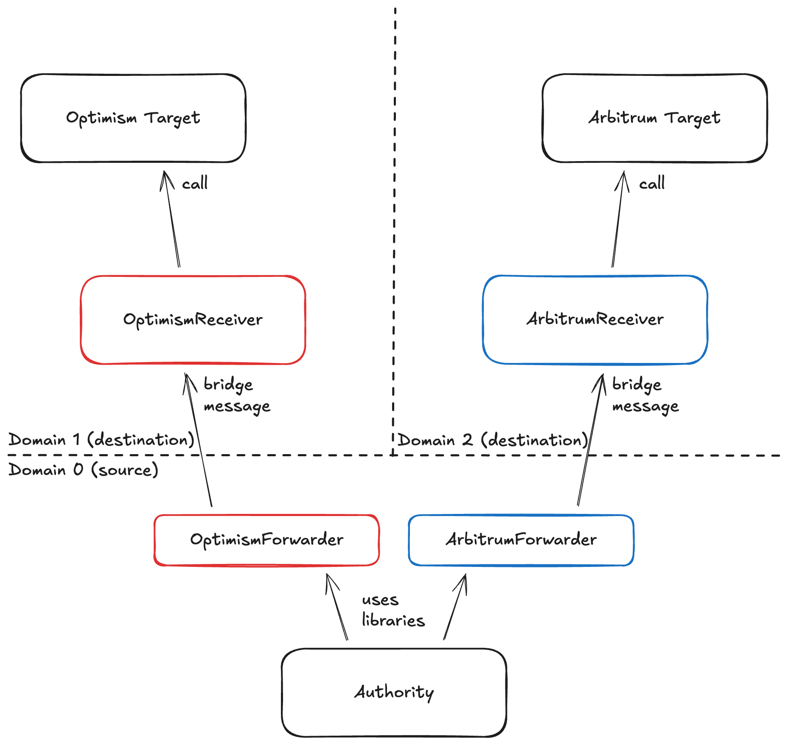

# ⛓️🌳 Grove XChain Helpers ⛓️🌳

This repository introduces three tools for use with multi-chain development.
- Forwarder
- Receiver
- BridgeTesting

This toolkit also introduces a Domain type. Domains refer to blockchains which are connected by bridges. Domains may have multiple bridges connecting them, for example both the Optimism Native Bridge and Circle CCTP connect Ethereum and Optimism domains.

## ⚙️ Components

### ✉️ Forwarders

These libraries provide standardized syntax for sending a message to a bridge.
They are intended to be used in contracts originating crosschain messages.

### 📬 Receivers

These contracts are responsible for decoding crosschain messages and performing a generic call on a target contract, encoded in the message.

### 🏤 Bridge Testing

These helpers tooling to record messages sent to supported bridges and relay them on the other side simulating a real message going across.

## 🏗️ Architecture & Usage

The most common pattern is to have an authorized contract forward a message to another "business logic" contract to abstract away bridge dependencies. Receivers are contracts which perform this generic translation - decoding the bridge-specific message and forwarding to another `target` contract. The `target` contract should have logic to restrict who can call it and permission this to one or more bridge receivers.

Most receivers implement a `fallback()` function which after validating that the call came from an authorized party on the other side of the bridge will forward the call to the `target` contract with the same function signature. This separation of concerns makes it easy for the receiver contract to focus on validating the bridge message, and the business logic `target` contract can validate the `msg.sender` comes from the receiver which validates the whole process. This ensures no chain-specific code is required for the business logic contract.

## 📯 Supported Bridges
- AMB
- Arbitrum _(ETH as a native token)_
- Arbitrum _(ERC20 as a native token)_
- CCTP v1
- CCTP v2
- Layer Zero
- Optimism

